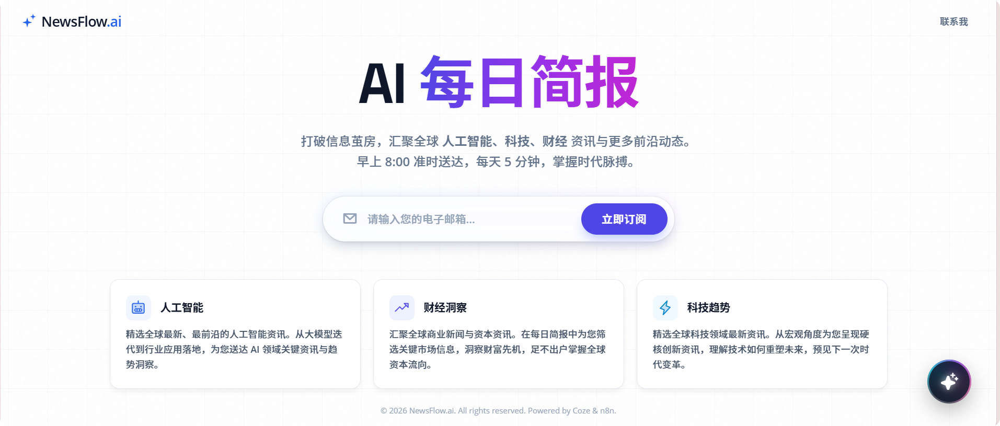
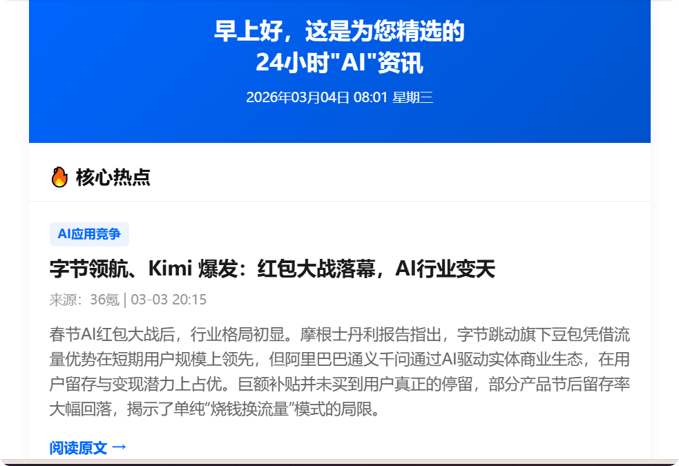

# NewsFlow.ai / AI 每日简报

[](https://opensource.org/licenses/MIT)

NewsFlow.ai 是一款由 AI 驱动的新闻聚合与推送助手。它从16个中文主流媒体 RSS 源自动抓取内容，经过两级过滤，压缩成每日 8 条高质量摘要 + 10 条快速查阅的简报内容，通过邮件推送或对话查询的方式送达用户。

## 界面预览 (Screenshots)

| 产品主页 | Bot 页面 | 邮件简报 |
|---|---|---|
|  |  |  |

## 功能特点 (Features)

- 🎯 **日报三大主题选择**：精准覆盖AI、财经、科技三大热门领域。
- 📧 **每日新闻邮件测试发送**：支持实时发送指定主题的新闻简报测试邮件。
- 💬 **Coze AI助手支持**：集成Coze Chat SDK，提供智能对话交互。
- 🎨 **精美的响应式 UI**：采用 Tailwind CSS 构建的现代化、多端适配的 UI 界面。

## 技术栈 (Tech Stack)

- **Frontend**: HTML5, Tailwind CSS, Vanilla JS
- **Backend**: Node.js, Express, Axios
- **Workflow / Data**: Coze Workflow, Supabase (via env)

## 项目结构 (Project Structure)

```text
newsflow-showcase/
├── backend/                # Node/Express 后端
│   ├── .env.example        # 脱敏后的环境变量示例
│   ├── routes/             # API 路由
│   ├── lib/                # 业务辅助库
│   └── server.js           # 服务入口
├── frontend/               # 前端静态资源
│   ├── index.html          # 主页面
│   ├── js/                 # 前端逻辑
│   └── assets/             # 静态资源
├── workflow/               # 流程导出（已脱敏）
├── docs/                   # 文档目录
├── tests/                  # 自动化测试脚本与样例
└── README.md
```

## 快速开始 (Quick Start)

1. 安装并启动后端

```bash
cd backend
npm install
npm start
```

2. 打开页面：`http://localhost:3000/`

## 配置说明 (Environment)

复制 `backend/.env.example` 为 `backend/.env` 并填写你自己的配置。

常用变量：

- `COZE_API_TOKEN`
- `COZE_WORKFLOW_ID`
- `COZE_BASE_URL`
- `COZE_BOT_ID`
- `SUPABASE_URL`
- `SUPABASE_SERVICE_ROLE_KEY`
- `ALLOWED_ORIGINS`

## 安全提示 (Security)

- 本仓库不包含真实 API Key / Token / 私密配置。
- `workflow/` 已做脱敏处理（如 `Authorization`, `Bearer`, token 字段）。
- `docs` 仅保留各模块最新版本文档（文本文件），不公开测试数据二进制文件。
- 严禁提交 `backend/.env`。

## 许可证 (License)

[MIT](LICENSE)
