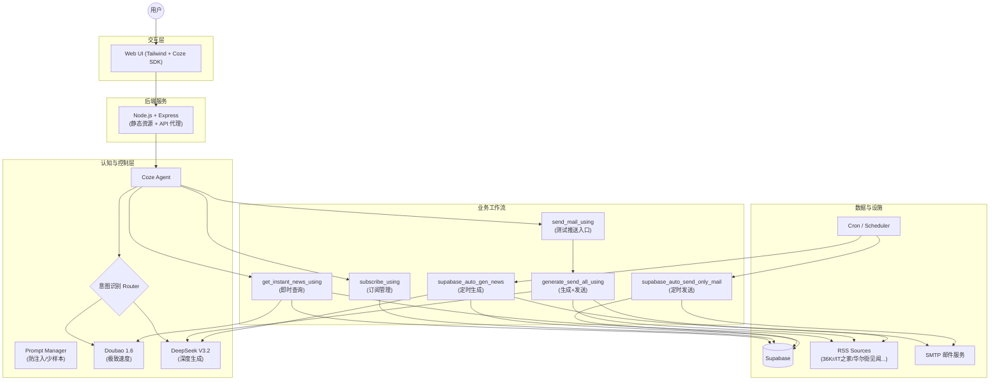
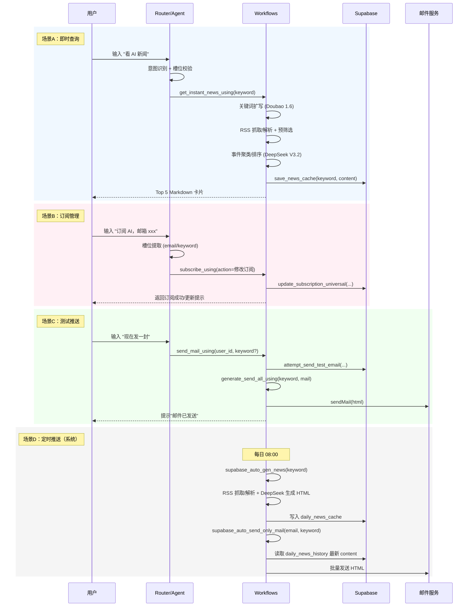

# NewsFlow.ai 产品需求文档 v2.0（完整版）

> 文档版本：v2.0（完整版）  
> 状态：Post-Launch（基于已交付版本的复盘 + 迭代规划）  
> 最后更新：2026-02-03  
> 语言：中文  
> 相关文档：`docs/02-模型选型分析报告.md`（单独维护）

---

## 0. 这份 PRD 的用途（避免概念混淆）

在公司语境里，PRD 通常用于**在开发前对齐目标与需求**；但对于一个已经交付的产品（尤其是面试作品集），PRD 也承担“可审计的交付说明书”的职责。

因此，本 PRD 同时包含两部分：

- **事实与现状（总结）**：当前系统已经做到了什么、怎么做的、效果指标和 Bad Case 修复。
- **下一步规划（规划）**：基于现状，下一版本应该优化什么、目标是什么、怎么验证。

你可以把它理解为：

- Part A：给“读者/面试官/协作方”的最新产品说明
- Part B：给“下一阶段开发”的需求与目标对齐

---

## 1. 产品概述

### 1.1 产品定义

NewsFlow.ai 是一款基于 LLM 的智能新闻订阅助手，面向泛科技/金融领域的知识工作者，提供：

- 即时新闻查询（聊天式）
- 订阅管理（新增/查询/修改/取消）
- 每日定时 HTML 日报邮件推送（默认 08:00）

核心目标：让用户以更低的认知成本获取“24 小时内最重要的行业变化”。

### 1.2 目标用户与典型场景

目标用户：

- 泛科技从业者：需要跟踪 AI/科技领域动态
- 金融从业者：需要跟踪财经/宏观/市场动态
- 深度研究者：需要快速扫描并定位原文链接

典型场景：

- 上班通勤：打开网页/对话框“看看 AI 24h 热点”
- 上午工作开始前：邮箱收到 08:00 日报，一次浏览掌握全貌
- 临时需求：向同事汇报前，快速检索“某公司/某政策”的相关新闻摘要

### 1.3 核心痛点与价值主张

痛点：

1. 信息过载：重复内容、标题党、SEO 垃圾
2. FOMO：担心漏掉关键事件
3. 信任断层：AI 摘要幻觉/时间错乱
4. 工具断层：RSS 维护成本高，推荐流容易茧房

价值主张：

- 降噪：多源聚合 + 语义去重 + Top-K 结构化筛选
- 抗焦虑：定时推送 + 热点排序
- 增信：引用优先（每条新闻都带原文链接）

---

## 2. 范围定义

### 2.1 本版本包含（v1.x 已交付）

- 三大主题：AI / 财经 / 科技
- 即时查询：输出 Top 5 Markdown 卡片
- 订阅管理：查询/修改/取消
- 立即推送测试：手动触发生成并发送 HTML 邮件
- 定时推送：每日 08:00 触发自动发送（通过外部 Cron 或平台定时）
- 缓存：即时查询缓存 + 日报缓存（生成与发送解耦）

### 2.2 本版本不包含（明确不做）

- 付费体系、增长体系
- App 端（当前为静态网页 + 后端服务）
- 个性化精排（基于行为的推荐/点击追踪）

---

## 3. 关键指标（KPI）与结果

### 3.1 指标体系（当前已测 + 待补齐）

已测指标：

- 任务完成率（Task Completion）
- 意图识别准确率（Intent Accuracy）
- 槽位填充准确率（Slot Filling）
- 平均响应时间（Latency）

待补齐指标（保留在 PRD 中，作为后续评测计划）：

- 去噪比（SNR）：原始条数 -> 输出条数的压缩比
- 信任度：原文链接点击率（低点击并不必然等于高信任，但可作为 proxy）
- 死链率：输出链接可用性

### 3.2 v1.0 核心结果（来自核心回归集）

| 指标 | 结果 | 备注 |
| --- | --- | --- |
| 任务完成率 | 100% | 22/22 case 闭环 |
| 意图识别准确率 | 95.5% | 21/22 通过，1 个边界 case 需优化 |
| 槽位填充准确率 | 100% | 引入规则/CoT 后稳定 |
| 平均响应时间 | 8s | P99 < 15s（优化后） |

---

## 4. 产品体验与信息架构

### 4.1 用户旅程（简化）

1. 触达：打开网页（静态 UI）
2. 交互：对话框输入“看 AI 新闻”
3. 消费：阅读 Top 5 卡片摘要
4. 验证：点击引用链接回到原文
5. 留存：订阅 AI/财经/科技日报
6. 回访：次日 08:00 收到邮件日报

### 4.2 主题/关键词规范

- UI 主题：`ai` / `finance` / `tech`
- 订阅关键词（存储层）：`AI` / `财经` / `科技`

---

## 5. 功能需求（完整版）

### 5.1 即时新闻查询

用户故事：

- 作为用户，我希望输入“看看 AI 新闻”，快速得到 24 小时内最值得关注的 5 条新闻摘要，并能点击原文。

输入：

- keyword（必填）：AI / 财经 / 科技 或用户自定义关键词（v2.0 规划）
- 可选参数（高级用法）：
  - source：指定来源（若实现）
  - limit：条数限制
  - language：输出语种

输出：

- Markdown 卡片列表（Top 5），每条含：标题、时间、摘要、热度说明、来源链接

关键要求：

- 时效：只输出最近 24 小时内的内容
- 去重：同一事件多源报道归并，输出代表性一条
- 来源均衡：避免单一媒体霸屏（上限约 50%）

异常与兜底：

- 无结果：输出“暂无相关内容”并建议换关键词/换主题
- RSS 解析失败：提示稍后重试，并保证不输出空白

### 5.2 订阅管理（查询/修改/取消）

用户故事：

- 作为用户，我希望通过自然语言配置订阅信息（邮箱、主题），并能随时查询与取消。

输入：

- action（必填）：查询订阅 / 修改订阅 / 取消订阅
- input_user_id（必填）：从 System Context 提取
- new_email / ex_email（按场景可选）
- new_keyword（按场景可选）

输出：

- 确认卡片/文本：仅展示邮箱、主题、状态等必要字段（避免泄露 user_id）

校验：

- 邮箱格式校验
- 用户只能操作自己的订阅（user_id 强绑定）

### 5.3 立即推送（测试邮件）

用户故事：

- 作为用户，我希望立刻收到一封“与我订阅主题一致”的日报邮件，用于体验与验证。

行为：

- 优先读取用户已保存的邮箱/主题
- 若用户未配置，先引导完成配置

输出：

- 邮件发送成功提示 + 实际 HTML 邮件

### 5.4 定时推送（每日 08:00）

用户故事：

- 作为订阅用户，我希望每天 08:00 自动收到日报邮件。

实现要点（按当前工作流拆分）：

- 生成：抓取 RSS -> 深度摘要 -> 生成 HTML -> 写入缓存表（当前实现写入 `daily_news_cache`）
- 发送：读取缓存（当前实现从 `daily_news_history` 读取最新一条内容）-> 批量发送

说明：生成缓存与发送缓存目前使用了不同的数据源（`daily_news_cache` vs `daily_news_history`）。如果 Supabase 侧存在同步视图/触发器，该逻辑可保持；否则建议在 v1.1 做一次链路对齐（见 Roadmap）。

---

## 6. 系统架构与工作流设计

### 6.1 技术栈

- 前端：`frontend/index.html`（Tailwind + Inline JS + Coze Chat SDK）
- 后端：Node.js + Express（静态资源 + API proxy）
- AI：Coze Agent + Workflows
- 数据：Supabase（订阅 + 缓存）
- 邮件：SMTP（当前为 QQ SMTP；后续可替换为 Resend/SES）

### 6.2 现有工作流清单（6 个）

Agent 调度相关：

- `get_instant_news_using`：即时查询（含缓存 RPC）
- `subscribe_using`：订阅管理（RPC：query/update/unsubscribe）
- `send_mail_using`：测试推送入口（RPC：attempt_send_test_email + 子工作流）
- `generate_send_all_using`：生成并发送邮件（被 `send_mail_using` 内嵌调用）

定时任务相关：

- `supabase_auto_gen_news`：自动生成日报内容并写入 `daily_news_cache`
- `supabase_auto_send_only_mail`：读取 `daily_news_history` 最新内容并发送

### 6.3 Mermaid：系统架构图（可在 GitHub 渲染）

同时保留你现有的图片版本（便于 PPT/简历截图）：

- `docs/系统架构图.png`

### 6.4 Mermaid：业务流程（对齐现状）

同时保留你现有的图片版本：

- `docs/业务流程图.png`

注：即时查询流程中实际存在 `get_news_cache` 的命中分支；当命中缓存时，可直接返回缓存内容并跳过下游生成。

---

## 7. 模型策略（只在 PRD 中概述）

本项目在 Coze 的可选模型范围内（豆包/DeepSeek/Kimi 等）采用“分层模型”策略：

- 轻量任务（关键词扩写/路由/槽位校验）：优先使用豆包 1.6 极致速度模型
- 重量任务（摘要聚类/排序/生成 HTML）：使用 DeepSeek V3.2

详细对比、评测维度、成本测算与结论，请见：`docs/02-模型选型分析报告.md`。

---

## 8. 评测体系与 Bad Case（重点）

### 8.1 评测集结构

现有评测采用“两层结构”：

- 核心回归集（22 条）：用于保证关键路径闭环（订阅、查询、推送等）
- 扩展评测集（约 100 条）：覆盖一级/二级意图、多轮对话、边界输入

### 8.2 指标定义（可复用到自动评测）

- 任务完成率：用户目标是否闭环（返回可用结果 / 配置成功 / 邮件发送成功）
- 意图识别准确率：是否路由到正确工作流（或正确兜底）
- 槽位填充准确率：邮箱/主题/数量/来源等是否正确提取并用于执行
- 延迟：端到端时间（含 RSS 获取、LLM、缓存命中等）

### 8.3 代表性 Bad Case（8 例）

以下案例来自坏例记录表（按“现象-根因-修复-验证”结构沉淀，便于面试讲述）：

1) 时间幻觉（Bug-03）

- 现象：发布时间不符或时区错乱
- 根因：信源时间格式不统一 + 未做时区转换 + 误用抓取时间
- 修复：切换 RSS 信源 + 代码节点标准化时间（强制北京时间）
- 验证：回归集中相关 case 通过

2) 响应超时（Bug-05）

- 现象：响应超过 40s
- 根因：多源 RSS 原始列表直接喂给大模型，输入 token 过大
- 修复：代码节点预筛选 Top-K + 流式输出 + 模型升级
- 验证：平均响应 ~8s，P99 < 15s

3) System Prompt 泄露（Bug-12）

- 现象：用户诱导获取系统提示词成功
- 根因：缺少对抗注入的最高优先级规则
- 修复：System Prompt 头部加入强边界 + 关键字触发拒答
- 验证：注入用例通过

4) 多轮关键词未保存（Bug-06）

- 现象：用户补充关键词后未写入
- 根因：关键词提取规则薄弱，上下文关联失效
- 修复：Prompt 增加关键词提取规则与 few-shot
- 验证：多轮场景通过

5) 多轮邮箱补充异常（Bug-07）

- 现象：已给关键词仍反复追问关键词
- 根因：上下文槽位复用策略不稳定
- 修复：Prompt 增加“已给出则复用”的规则与示例
- 验证：多轮场景通过

6) 类别幻觉（Bug-13）

- 现象：编造不存在的新闻类别
- 根因：未限制可选主题范围
- 修复：System Prompt 明确支持范围 + 兜底话术
- 验证：类别查询用例通过

7) 隐私越权（Bug-16）

- 现象：可查询其他 user_id 的配置
- 根因：缺少强边界（以及存储侧未强绑定）
- 修复：Prompt 加入“只能操作自己的订阅”硬约束；调用侧强制使用 System Context 的 user_id
- 验证：越权用例通过

8) 邮件体验与 Token 成本（Bug-11）

- 现象：邮件纯文本视觉差，token 消耗大
- 根因：未使用结构化模板 + 输入未做预处理
- 修复：引入 HTML 模板 + Query 改写/预筛选
- 验证：邮件可读性提升，延迟下降

---

## 9. 风控与安全

### 9.1 安全原则

- 不泄露系统提示词、密钥、内部实现细节
- 不展示 user_id 给用户
- 不允许跨用户查询/操作订阅

### 9.2 数据与密钥

本仓库与文档**不应包含任何真实密钥**。所有密钥应通过环境变量或平台密钥管理配置。

（注：如果你当前工作流导出文件中包含真实 token/SMTP 密码，建议尽快轮换并清理版本历史；这不写进 PRD，但属于必须处理的工程卫生。）

---

## 10. 迭代规划（Roadmap）

### 10.1 v1.0（已完成）

- 即时查询/订阅管理/测试推送/定时推送链路跑通
- 关键风控：注入防御、隐私边界、无结果兜底
- 缓存：即时查询缓存（RPC）+ 日报缓存（DB）

### 10.2 v1.1（体验优化，建议 2-4 周）

目标：把“可用”打磨成“好用”，并补齐可持续迭代的评测闭环。

建议任务：

1. 缓存链路对齐

- 对齐 `daily_news_cache` 与 `daily_news_history` 的生成/读取关系（表、视图或写入节点统一）
- 为日报缓存增加“时间戳/版本号”，避免发送到旧内容

2. 延迟优化

- RSS 抓取并发与超时策略优化
- 减少模型输入体积（更强的预筛选 + 压缩输入字段）
- 目标：平均 < 5s，P99 < 10-12s

3. 意图与槽位鲁棒性

- 解决“纯关键词输入”与“配置意图”混淆
- 增加对混合指令（一次性提供邮箱+主题+立即发送）的优先级规则

4. 自动评测落地

- 将现有评测集迁移到 Coze 数据测评能力
- 输出：按指标自动生成报表 + 每次改 Prompt/Workflow 后自动回归

### 10.3 v2.0（功能扩展，建议 1-2 个月）

- 自定义关键词订阅（长尾主题）
- 透明过滤漏斗（用户可选择“只看头条/全量”）
- 多模态日报（播客脚本/TTS）

---

## 附录

### A. 工作流与 Supabase 接口（不含密钥）

- 即时查询缓存：RPC `get_news_cache` / `save_news_cache`
- 订阅管理：RPC `update_subscription_universal` / `query_subscription_universal` / `unsubscribe_universal`
- 测试推送权限检查：RPC `attempt_send_test_email`

### B. 相关文件

- 精简版 PRD：`docs/01-PRD-产品需求文档-v2.0.md`
- 系统提示词：`coze_workflow/agent系统提示词.txt`
- 工作流导出：`coze_workflow/Workflow-*/workflow/*.yaml`
- 图片（原图）：`docs/系统架构图.png`、`docs/业务流程图.png`
