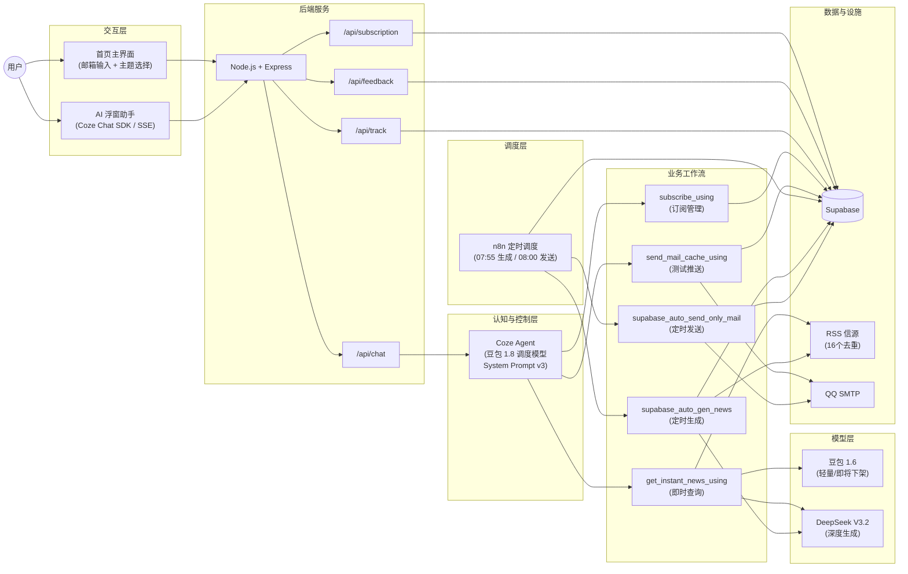
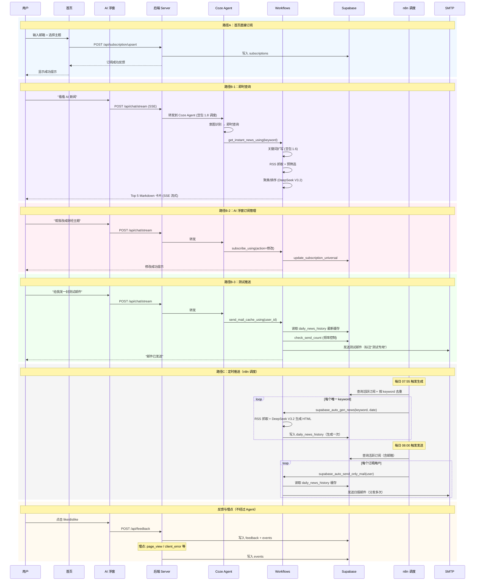

# PRD v3.0 补丁文件

> 本文件列出所有需要修改的区块，格式为：旧内容 → 新内容
> 请在 `docs/prd等过程文件/01-prd/prd-v3.0.md` 中逐一替换

---

## 补丁 1：文档头部日期（第 5 行）

**旧：**
```
> 最后更新：2026-02-17  
```

**新：**
```
> 最后更新：2026-02-18  
```

---

## 补丁 2：§5.4 每日定时推送（第 367-386 行）

**旧：**
```markdown
### 5.4 每日定时推送

**用户故事**：作为订阅用户，我希望每天 08:00 自动收到日报邮件。

**流程（两步解耦）**：

\```
Step 1: 生成（supabase_auto_gen_news）
  Cron 触发 → 按主题分别抓取 RSS → DeepSeek V3.2 深度摘要 → 生成 HTML → 写入 daily_news_history

Step 2: 发送（supabase_auto_send_only_mail）
  Cron 触发 → 从 daily_news_history 读取最新日报 → 查询所有活跃订阅用户 → 批量发送 HTML 邮件
\```

**缓存策略**：
- 生成一次，分发多次：同一主题的日报只生成一次 HTML，所有该主题的订阅用户共享同一份内容
- 推送测试也从同一缓存读取，保证用户看到的测试邮件与正式日报内容一致

**模型策略**：
- 深度摘要 / HTML 生成：DeepSeek V3.2（重量任务，质量优先）
```

**新：**
```markdown
### 5.4 每日定时推送

**用户故事**：作为订阅用户，我希望每天 08:00 自动收到日报邮件。

**调度中枢**：n8n 自托管工作流平台（配置文件：`workflow/n8n-workflow/订阅推送（supabase）.json`）

**流程（两步解耦，n8n 调度）**：

```
Step 1: 生成（07:55 触发）
  n8n Cron(07:55) → 格式化时间(+5min=08:00) → 查询 Supabase 活跃订阅
  → 按 keyword 去重 → 对每个唯一 keyword 异步调用 Coze 工作流 supabase_auto_gen_news
  → 工作流内部：抓取 RSS → DeepSeek V3.2 深度摘要 → 生成 HTML → 写入 daily_news_history

Step 2: 发送（08:00 触发）
  n8n Cron(08:00) → 查询 Supabase 活跃订阅（含邮箱）
  → 对每个用户异步调用 Coze 工作流 supabase_auto_send_only_mail
  → 工作流内部：读取 daily_news_history 缓存 → 发送 HTML 邮件
```

**为什么提前 5 分钟生成**：确保 08:00 发送时缓存已就绪。生成耗时约 1-3 分钟（含 RSS 抓取 + LLM 摘要），5 分钟留有余量。

**关键词去重**：多个用户订阅同一主题时，只触发一次生成。例如 3 个用户都订了 AI，只调用一次 `supabase_auto_gen_news(keyword=ai)`，生成的 HTML 缓存被 3 个用户共享。

**缓存策略**：
- 生成一次，分发多次：同一主题的日报只生成一次 HTML，所有该主题的订阅用户共享同一份内容
- 推送测试也从同一缓存读取，保证用户看到的测试邮件与正式日报内容一致

**模型策略**：
- 深度摘要 / HTML 生成：DeepSeek V3.2（重量任务，质量优先）
```

---

## 补丁 3：§7.1 技术栈 - 模型行（第 439 行）

**旧：**
```
| 模型 | 豆包 1.6（轻量）+ DeepSeek V3.2（重量） | 分层模型策略（详见 `docs/02-模型选型分析报告.md`） |
```

**新：**
```
| 模型 | 豆包 1.8（调度）+ 豆包 1.6（轻量）+ DeepSeek V3.2（重量） | 三层模型策略（详见 §8 及 `docs/02-模型选型分析报告.md`） |
```

---

## 补丁 4：§7.2 工作流清单 - 触发方式列（第 453-454 行）

**旧：**
```
| `supabase_auto_gen_news` | 定时生成日报 HTML 并写入缓存 | Cron 定时 | RSS 信源、DeepSeek V3.2、Supabase |
| `supabase_auto_send_only_mail` | 定时读取缓存并批量发送邮件 | Cron 定时 | `daily_news_history`、SMTP |
```

**新：**
```
| `supabase_auto_gen_news` | 定时生成日报 HTML 并写入缓存 | n8n 定时（07:55） | RSS 信源、DeepSeek V3.2、Supabase |
| `supabase_auto_send_only_mail` | 定时读取缓存并批量发送邮件 | n8n 定时（08:00） | `daily_news_history`、SMTP |
```

---

## 补丁 5：§7.3 系统架构图（第 463-552 行整体替换）

**新：**
```markdown
### 7.3 系统架构图

> v3.0 架构图相比 v2.0 的修正：
> 1. 新增 n8n 作为独立调度层（替代笼统的"Cron"）
> 2. 新增豆包 1.8 作为 Agent 调度模型（三层模型策略）
> 3. 测试推送工作流已从 `send_mail_using` 更新为 `send_mail_cache_using`
> 4. 补充了后端 API 直接处理的路径（订阅、反馈、埋点不经过 Coze Agent）
> 5. 补充了首页直接订阅路径（UI → Server → Supabase）

<!-- TODO: 导出 PNG 后替换为图片引用 -->
<!--  -->

<details>
<summary>Mermaid 源码（维护用）</summary>



</details>
```

---

## 补丁 6：§7.4 业务流程图（第 554-630 行整体替换）

**新：**
```markdown
### 7.4 业务流程图

<!-- TODO: 导出 PNG 后替换为图片引用 -->
<!--  -->

<details>
<summary>Mermaid 源码（维护用）</summary>



</details>
```

---

## 补丁 7：§8 模型策略（第 645-678 行整体替换）

**新：**
```markdown
## 8. 模型策略

> 详细对比、评测维度、成本测算见：`docs/02-模型选型分析报告.md`

### 8.1 三层模型分工

本项目在 Coze 平台可选模型范围内采用"三层分工"策略：

| 层级 | 模型 | 选择理由 | 使用场景 |
| --- | --- | --- | --- |
| 调度层 | 豆包 1.8（Coze Agent 外控模型） | 意图识别准确、槽位遵循度高，调度评测中豆包 1.6 综合分优于 DeepSeek V3.1，后升级至 1.8 | Agent 意图路由、参数提取、多轮补槽、调用守卫 |
| 轻量执行 | 豆包 1.6 极致速度 | 响应快、成本低，适合确定性高的任务 | 关键词扩写（⚠️ 约一个月后下架） |
| 重量执行 | DeepSeek V3.2 | 理解力强、生成质量高 | 新闻聚类排序、深度摘要、HTML 日报生成 |

> **调度模型选型历史**：v1.0 评测阶段对比了豆包 1.6 与 DeepSeek V3.1（50 条调度评测集），豆包在槽位/指令遵循维度满分（18/18），综合分更高，因此选定豆包作为调度模型。后续豆包 1.8 发布后直接升级，未重新进行对比测试。

### 8.2 代码节点与模型节点分工（设计亮点）

> 核心原则：确定性的事不交给 LLM，需要判断力的事不用硬编码。

| 任务 | 处理方式 | 理由 |
| --- | --- | --- |
| RSS 抓取与 XML 解析 | 代码节点（Python） | 纯确定性操作，模型做不了也不该做 |
| 时间解析与时区转换 | 代码节点（Python） | 多格式兼容需要精确逻辑，模型容易出错（Bug-03 的教训） |
| 预筛选（Top-K、去重、时效过滤） | 代码节点（Python） | 减少喂给模型的 token 量，降低成本和延迟 |
| 关键词扩写 | 模型节点（豆包 1.6） | 需要语义理解，但任务简单，轻量模型即可 |
| 新闻聚类、排序、摘要 | 模型节点（DeepSeek V3.2） | 需要深度理解和生成能力 |
| HTML 日报生成 | 模型节点（DeepSeek V3.2） | 需要结构化输出和排版能力 |

### 8.3 风险：豆包 1.6 下架

豆包 1.6 极致速度模型预计约一个月后下架。影响范围：

- 即时查询的关键词扩写环节
- 需提前测试替代轻量模型（如豆包后续版本或其他 Coze 平台可用的轻量模型）
- 替代标准：响应速度 ≤ 2s，关键词扩写质量不低于当前水平
```

---

## 补丁 8：§10 评测体系精简（第 743-801 行整体替换）

**新：**
```markdown
## 10. 评测体系与质量保障

> 完整的测试架构、评测维度、用例设计方法论、Badcase 全量表及回归策略见：`docs/prd等过程文件/04-评测与质量报告/04-评测与质量报告-v3.0.md`

### 10.1 测试体系总览

| 层级 | 测试套件 | 用例数 | 测试目标 |
| --- | --- | --- | --- |
| L1 工作流单元测试 | subscribe_using | 14 | 订阅管理 CRUD + 边界 |
| | instant_news | 20 | 即时查询质量与来源约束 |
| | send_mail_cache | 8 | 缓存推送链路 |
| | mail_push | 9 | 邮件生成与发送 |
| | gen_news | 3 | 定时生成工作流 |
| L2 调度模型测试 | dispatch_suite v1 | 50 | 意图路由 + 参数提取（STUB 工作流） |
| | dispatch_suite v2 | 66 | 扩展覆盖 + 多轮对话 |
| L3 端到端测试 | agent_e2e | 43 | 真实工作流全链路验证 |
| **合计** | **8 套件** | **213** | |

### 10.2 核心质量指标

来自 L1 核心回归集（22 条）+ L2 调度评测：

| 指标 | 结果 | 说明 |
| --- | --- | --- |
| 任务完成率 | 100%（22/22） | L1 核心路径全部闭环 |
| 意图识别准确率 | 95.5%（21/22） | 1 个边界 case 待优化 |
| 槽位填充准确率 | 100% | 引入规则 / CoT 后稳定 |
| 平均响应时间 | ~8s | P99 < 15s |
| 调度层槽位遵循 | 100%（18/18） | 豆包 1.6 在选型评测中满分 |

### 10.3 Badcase 统计

采用统一 ID 规范 `BC-{MODULE}-{SEQ}`，共 6 个模块：

| 模块 | 含义 | 已解决 | 观察中 |
| --- | --- | ---: | ---: |
| QUERY | 即时查询 | 7 | 0 |
| SUB | 订阅管理 | 3 | 0 |
| PUSH | 推送相关 | 2 | 1 |
| DISPATCH | 调度层 | 4 | 0 |
| AGENT | Agent 行为 | 4 | 1 |
| TOOL | 评测工具 | 1 | 1 |
| **合计** | | **21** | **3** |

Badcase 全量表（含新旧 ID 映射、根因分析、修复策略）见评测报告 §4。
```

---

## 补丁 9：§7.3 架构图中的 Cron 节点（第 508 行）

已在补丁 5 中整体替换，n8n 替代了 Cron。

---

## 补丁 10：附录 C 相关文档（第 912-926 行整体替换）

**新：**
```markdown
### C. 相关文档

| 文档 | 路径 |
| --- | --- |
| PRD v2.0（完整版） | `docs/prd等过程文件/01-prd/01-PRD-产品需求文档-v2.0-完整版.md` |
| PRD v2.0（精简版） | `docs/prd等过程文件/01-prd/01-PRD-产品需求文档-v2.0.md` |
| 模型选型分析报告 | `docs/prd等过程文件/02-模型选项分析报告/02-模型选型分析报告-v1.1.md` |
| Prompt 工程手册 | `docs/prd等过程文件/03-Prompt工程手册/03-Prompt工程手册-v2.0.md` |
| 评测与质量报告 | `docs/prd等过程文件/04-评测与质量报告/04-评测与质量报告-v3.0.md` |
| 项目复盘总结 | `docs/prd等过程文件/05-项目复盘总结/05-项目复盘总结-v2.0.md` |
| 竞品分析 | `docs/prd等过程文件/06-竞品分析.md` |
| 需求调研报告 | `docs/prd等过程文件/07-需求调研报告.md`（待创建） |
| 信源管理 | `docs/prd等过程文件/信源管理.md` |
| 埋点说明 | `docs/prd等过程文件/埋点说明.md` |
| Agent 系统提示词 v3 | `coze_workflow/agent系统提示词v3.txt` |
| Badcase 合集 | `docs/badcase合集/badcase合集（更新中）.xlsx` |
| n8n 工作流配置 | `workflow/n8n-workflow/订阅推送（supabase）.json` |
```

---

## 补丁 11：§7.3 和 §7.4 移除 Mermaid 源码（约砍 150 行）

§7.3 和 §7.4 的 Mermaid 代码块已经导出为 PNG（`docs/项目工程图/3.0版本/`），PRD 里不需要保留完整源码。

**§7.3 整体替换为：**
```markdown
### 7.3 系统架构图

> v3.0 架构图相比 v2.0 的修正：
> 1. 新增 n8n 作为独立调度层（替代笼统的"Cron"）
> 2. 新增豆包 1.8 作为 Agent 调度模型（三层模型策略）
> 3. 测试推送工作流已从 `send_mail_using` 更新为 `send_mail_cache_using`
> 4. 补充了后端 API 直接处理的路径（订阅、反馈、埋点不经过 Coze Agent）
> 5. 补充了首页直接订阅路径（UI → Server → Supabase）


> Mermaid 源码维护文件：`docs/项目工程图/3.0版本/系统架构图-mermaid代码.md`
```

**§7.4 整体替换为：**
```markdown
### 7.4 业务流程图


> Mermaid 源码维护文件：`docs/项目工程图/3.0版本/业务流程图-mermaid代码.md`
```

注意：补丁 5 和补丁 6 中带 `<details>` 折叠 Mermaid 的版本作废，以本补丁为准。

---

## 补丁 12：§9 Prompt 工程精简（第 681-740 行整体替换）

砍掉 §9.1 模块详情表（已在 Prompt 手册 §2 中完整存在），只保留设计亮点摘要 + 演进表。

**新：**
```markdown
## 9. Prompt 工程（设计亮点与演进）

> 完整的提示词架构、模块说明、技能参数、维护清单见：`docs/prd等过程文件/03-Prompt工程手册/03-Prompt工程手册-v2.0.md`  
> 当前线上版本：`coze_workflow/agent系统提示词v3.txt`（373 行，9 个模块）

### 9.1 关键设计亮点

| 设计 | 一句话说明 | 来源 |
| --- | --- | --- |
| raw_query 透传 | Agent 只提取 keyword，用户原话原样传给下游模型自行解析约束 | 减少参数解析出错 |
| 调用守卫（Calling Guard） | 调用工作流前强制检查所有必填参数非空，缺则追问 | BC-DISPATCH-003 |
| 来源过滤自检 | 输出前逐条检查来源是否匹配，不匹配则删除 | BC-QUERY-001 |
| keyword 实体透传 | keyword 归一化走信源分支，raw_query 保留原话给下游理解意图 | 路由与理解解耦 |
| 动作后反馈识别 | 区分"用户在反馈上一轮结果"和"发起新意图" | 多轮对话准确性 |

### 9.2 演进历程

| 版本 | 核心变化 | 驱动因素 |
| --- | --- | --- |
| v0 | 基础意图识别 | 初始搭建 |
| v1 | 意图识别表 + 技能路由 | 核心链路跑通 |
| v2 | user_id 注入规则 + Few-shot 示例 | Bug-07（多轮邮箱补充异常）、Bug-16（隐私越权） |
| v3（当前） | 调用守卫 + 实体透传 + 多轮补槽 + 反馈识别 + 非任务 4 级处理 | 评测集扩展后发现的 dispatch 类 badcase |
```

---

## 补丁 13：§2.1 基础设施"用户标识"行后新增 user_id 说明（第 116 行之后插入）

在基础设施表格之后、§2.2 之前，插入以下内容：

**插入位置**：第 117 行（`| 健康检查 | ...` 之后）

**新增：**
```markdown

> **关于 user_id 过渡方案的说明**
>
> 当前用户标识采用浏览器端随机生成 `user_id`（`crypto.randomUUID()`），存储在 `localStorage` 中。这是一个有意识的过渡方案，而非遗漏：
>
> **已知局限**：
> - 换设备、换浏览器、清除浏览器数据 → `user_id` 丢失 → 用户在 AI 浮窗中无法查询/管理之前的订阅
> - 同一用户可能在 `subscriptions` 表中产生多条记录（不同 `user_id`，同一邮箱）
> - 首页直接订阅路径不受影响（通过邮箱匹配，非 `user_id`）
>
> **为什么现阶段可以接受**：
> - 种子测试阶段用户量极小（5-10 人），出现问题可人工协助
> - 邮件推送链路不依赖 `user_id`（通过邮箱 + 订阅状态匹配），核心价值不受影响
> - 引入账户体系的开发成本远高于当前阶段的收益
>
> **迁移路径**（v2.0 规划）：
> - 引入邮箱验证登录（Magic Link 或验证码），将邮箱作为用户唯一标识
> - 迁移时通过邮箱关联历史 `user_id`，合并订阅记录
> - 详见 §12.4 v2.0 功能扩展
```
