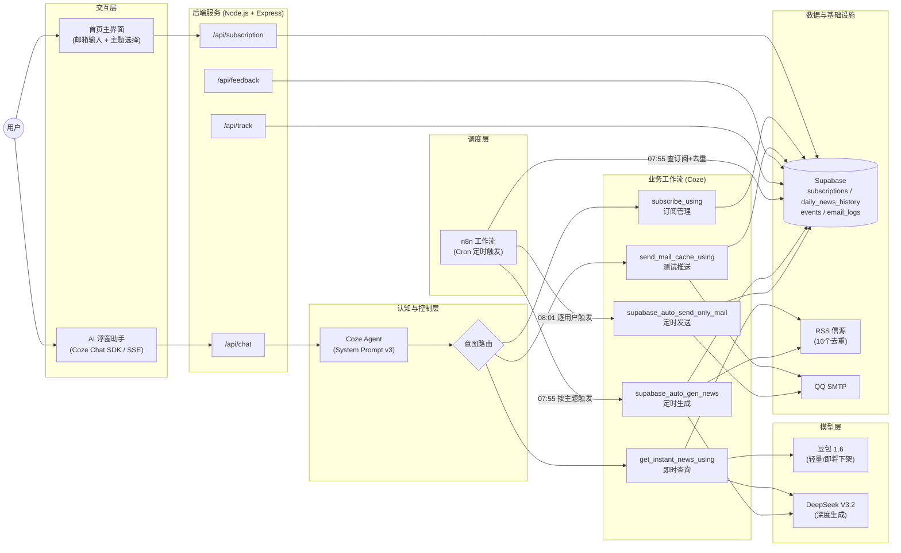
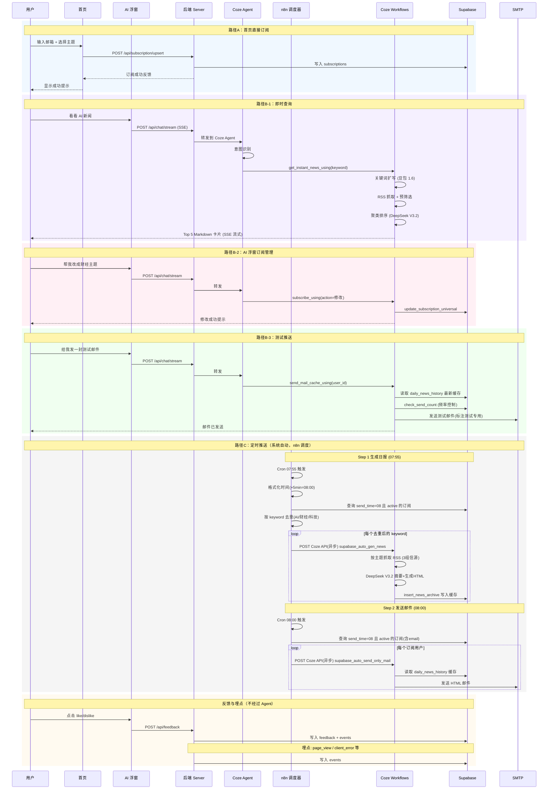

# NewsFlow.ai 产品需求文档 v3.0

> 文档版本：v3.3
> 状态：Post-MVP（种子用户测试前的全面梳理）
> 最后更新：2026-02-17
> 语言：中文
> 相关文档：`docs/02-模型选型分析报告.md`、`docs/03-Prompt工程手册.md`、`docs/04-评测与质量报告.md`

---

## 0. 本文档定位

本 PRD 是在 MVP 交付后、种子用户测试前的一次全面梳理，目的是：

1. **对齐现状**：准确记录系统已实现的全部能力（含代码中已有但旧版 PRD 未覆盖的部分）
2. **指导测试**：为种子用户测试阶段提供清晰的功能边界和验收基准
3. **规划迭代**：基于测试反馈，明确下一步优化方向

与 v2.0 的区别：v2.0 侧重"已交付 + 面试展示"，v3.0 侧重"真实现状 + 种子测试 + 迭代规划"。

---

## 1. 产品概述

### 1.1 产品定义

NewsFlow.ai 是一个 AI 驱动的新闻聚合与订阅推送助手，通过对话交互串联"查新闻、订新闻、收新闻"三条核心链路，帮助用户以较低的时间和注意力成本获取每日行业资讯。

- 产品名：**NewsFlow.ai**
- 网页标题 / Tagline：**AI 每日简报**
- 一句话描述：帮你每天用 5 分钟搞定行业资讯的 AI 助手

### 1.2 目标用户

基于 MVP 开发和早期测试的实际情况，目标用户分为两层：

**核心用户（种子测试阶段重点）**：

- 对 AI / 科技 / 财经感兴趣，想低成本跟踪行业动态的人
- 不一定是从业者，或者是非技术从业者，但有持续获取资讯的习惯或意愿
- 典型画像：AI 产品经理（非技术从业者）、对 AI 感兴趣的职场人、科技爱好者

**进阶用户（后续拓展）**：

- 泛科技 / 金融从业者，有专业级信息需求
- 需要更高频、更精准的行业情报

**暂不覆盖**：

- 深度研究者（需要全文检索、论文追踪等能力，Top 5 摘要无法满足）

### 1.3 典型场景

- 早间通勤：打开网页或收到邮件，5 分钟浏览当日 AI / 财经 / 科技热点
- 临时需求：开会前快速查一下"某公司 / 某政策"的最新动态
- 订阅设置：告诉助手"我要订 AI 新闻，邮箱是 xxx"，之后每天自动收

### 1.4 核心痛点与价值主张

**主要痛点（已验证）**：

1. 信息焦虑与时间浪费：因担心错过重要动态（FOMO），每天翻多个信源，重复内容多、噪音大，花了时间还不确定有没有漏掉什么

**次要痛点（待验证）**：
2. 信任缺失：用户对 AI 生成内容天然不信任，需要可追溯的原文链接及权威信源，建立可信度
3. 获取门槛高：系统性跟踪行业动态没有低门槛方案——RSS 有技术门槛，手动巡逻耗时，算法推荐不可控

**价值主张**：

- 降噪：多源聚合 + 语义去重 + Top-K 结构化筛选
- 省时：定时推送 + 热点排序，不用主动找
- 可信：每条新闻带原文链接，且信源权威，可回溯验证

**价值验证映射**：

| 痛点                        | 价值主张 | 怎么解决的                                                   | 衡量指标                     | 当前结果                                              |
| --------------------------- | -------- | ------------------------------------------------------------ | ---------------------------- | ----------------------------------------------------- |
| 信息焦虑 / 噪音大           | 降噪     | 多源聚合 + 语义去重 + Top-K 筛选，两级过滤（规则层 + AI 层） | 端到端压缩比（去噪比）       | 即时查询 125:1，定时推送 16:1（§3.1）                |
| 时间浪费 / 每天翻多个信源   | 省时     | 定时推送自动送达 + 即时查询秒级响应 + 热点排序               | 首字响应时间；日报阅读时长   | P50~4s（§3.1）；日报阅读时长待种子测试收集（§3.2）  |
| 信任缺失 / AI 内容不可信    | 可信     | 每条新闻带原文链接 + 权威信源白名单 + 热度标注（≥2 家报道） | 用户主观信任度；链接可用率   | 定性收集中（§3.2）；人工抽检链接可用率 100%（§3.1） |
| 获取门槛高 / RSS 有技术门槛 | 零门槛   | 对话交互（说句话就能查）+ 邮箱订阅（填个邮箱就能收）         | 订阅转化率；用户主动使用频次 | 种子测试阶段收集中（§3.2、§3.3）                    |

> 已验证的痛点（信息焦虑）已有量化数据支撑；待验证的痛点（信任缺失、获取门槛）将在种子测试阶段通过用户反馈收集。

---

## 2. 范围定义

### 2.1 当前已实现（MVP）

#### 交互入口

用户通过两个入口与产品交互：

| 入口        | 形态                            | 承载的业务能力                         |
| ----------- | ------------------------------- | -------------------------------------- |
| 首页主界面  | Web 页面（主题选择 + 邮箱输入） | 订阅新增                               |
| AI 浮窗助手 | 流式 SSE 对话窗口（含取消）     | 即时查询、订阅管理、推送测试、兜底对话 |

AI 浮窗是主要交互入口，承载了大部分业务能力。首页主界面提供更直接的订阅路径（无需对话，输入邮箱即可）。两个入口的订阅操作共用同一张 `subscriptions` 表，数据一致。

#### 核心功能（用户使用产品的理由）

| 功能         | 说明                                                                                             | 触发方式                                                                    |
| ------------ | ------------------------------------------------------------------------------------------------ | --------------------------------------------------------------------------- |
| 即时新闻查询 | 输入关键词，返回 24h 内 Top 5 新闻摘要卡片（Markdown），每条含标题、时间、摘要、来源链接         | 用户在 AI 浮窗中提问                                                        |
| 订阅管理     | 新增 / 查询 / 修改 / 取消订阅（邮箱 + 主题）                                                     | 首页输入框（后端 API → Supabase）或 AI 浮窗对话（Coze 工作流 → Supabase） |
| 推送测试     | 将当日已生成的日报缓存以测试邮件形式发送给用户，让用户立即体验邮件效果（邮件主题标注"测试专用"） | 用户在 AI 浮窗中请求                                                        |
| 每日定时推送 | 每日 08:00 自动生成日报 HTML 并缓存，然后批量发送给所有订阅用户。生成一次、分发多次              | 系统定时任务（Cron），用户订阅后自动触发                                    |

- 三大主题：AI / 财经 / 科技
- 多语言输出：模型本身支持，用户可用中文或英文提问并获得对应语言回复
- 订阅管理中的"新增订阅"主要通过首页输入框和 AI 对话完成，订阅管理模块内的新增操作更多是功能完整性补充

#### 体验功能（让核心功能用起来更好）

> 产品分层小贴士：体验功能 ≠ 不重要。它们不是用户来用产品的"理由"，但去掉会让体验明显变差。比如兜底对话——用户不会因为"被友好拒绝"来用你的产品，但没有它，用户问了无关问题得到混乱回复，信任感就崩了。

| 功能     | 说明                                                                                                                                      | 为什么是体验功能而非核心功能                                                         |
| -------- | ----------------------------------------------------------------------------------------------------------------------------------------- | ------------------------------------------------------------------------------------ |
| 用户反馈 | 对 bot 回复进行 like / dislike，dislike 可选原因（不相关、过时、太长、太短、来源不可靠、生硬、其他），like 可选标签（准确、精炼、有帮助） | 用户不会因为"能点赞"来用产品，但它让用户觉得"我的声音被听到"，同时为产品改进提供信号 |
| 兜底对话 | 非新闻相关话题的友好拒绝与引导                                                                                                            | 防御性体验设计：不提供这个能力，但要优雅地告诉用户"这个我不擅长"                     |

> **交互截图**：
>
> 
> *用户反馈交互：like/dislike 按钮 + dislike 原因选择面板*
>
> <!-- TODO: 截取一次 dislike 操作，展示原因选择面板的展开效果 -->

#### 基础设施（用户感知不到，但支撑运营与迭代）

| 能力     | 说明                                                                                                                         |
| -------- | ---------------------------------------------------------------------------------------------------------------------------- |
| 埋点系统 | 前端事件（page_view、client_error）+ 后端事件（workflow_call、email_sent、subscribe、feedback），写入 Supabase `events` 表 |
| 日报缓存 | 生成与发送解耦：每日定时生成 HTML 写入 `daily_news_history` 表，推送和测试发送均从缓存读取，一次生成、多次分发             |
| 接口限流 | 每个路由独立 rate limiter（chat 30/min、workflow 20/min、subscription 40/min、feedback 30/min、track 60/min）                |
| 用户标识 | 浏览器端生成随机 user_id（localStorage 持久化），作为过渡方案替代登录体系                                                    |
| 健康检查 | `/health` 端点，用于部署监控                                                                                               |

> **关于 user_id 过渡方案的说明**
>
> 当前用户标识采用浏览器端随机生成 `user_id`（`crypto.randomUUID()`），存储在 `localStorage` 中。这是一个有意识的过渡方案，而非遗漏：
>
> **已知局限**：
>
> - 换设备、换浏览器、清除浏览器数据 → `user_id` 丢失 → 用户在 AI 浮窗中无法查询/管理之前的订阅
> - 同一用户可能在 `subscriptions` 表中产生多条记录（不同 `user_id`，同一邮箱）
> - 首页直接订阅路径不受影响（通过邮箱匹配，非 `user_id`）
>
> **为什么现阶段可以接受**：
>
> - 种子测试阶段用户量极小（5-10 人），出现问题可人工协助
> - 邮件推送链路不依赖 `user_id`（通过邮箱 + 订阅状态匹配），核心价值不受影响
> - 引入账户体系的开发成本远高于当前阶段的收益
>
> **迁移路径**（v2.0 规划）：
>
> - 引入邮箱验证登录（Magic Link 或验证码），将邮箱作为用户唯一标识
> - 迁移时通过邮箱关联历史 `user_id`，合并订阅记录
> - 详见 §12.4 v2.0 功能扩展

### 2.2 数据表现状（Supabase）

> 梳理当前所有数据表的用途和状态，便于后续迭代时判断哪些要保留、合并或清理。

| 表名                   | 用途                                                                    | 状态               |
| ---------------------- | ----------------------------------------------------------------------- | ------------------ |
| `subscriptions`      | 用户订阅信息（邮箱、主题、状态、发送时间）                              | 在用，核心表       |
| `daily_news_history` | 每日生成的日报 HTML 缓存，用于统一分发（定时推送 + 测试推送均从此读取） | 在用，核心表       |
| `events`             | 埋点事件表（前端 + 后端事件）                                           | 在用               |
| `daily_email_logs`   | 新版测试发送邮件（使用缓存）的发送记录，记录用户使用情况                | 在用               |
| `email_logs`         | 旧版实时生成推送方案的发送记录                                          | 备选保留，暂不使用 |
| `daily_news_cache`   | 即时查询缓存表                                                          | 备选保留，功能暂停 |

### 2.3 暂停 / 待优化

| 功能         | 状态 | 说明                                                                                                               |
| ------------ | ---- | ------------------------------------------------------------------------------------------------------------------ |
| 即时查询缓存 | 暂停 | 之前通过 RPC `get_news_cache` / `save_news_cache` 实现，因细节问题暂时关闭，数据表保留作为备案，后续视情况恢复 |

### 2.3 明确不做（当前版本）

- 付费体系 / 增长体系
- App 端（当前为 Web 页面 + 后端服务）
- 个性化精排（基于行为的推荐 / 点击追踪）
- 用户注册登录体系（当前用设备级 user_id 过渡）
- 社交分享功能（后续可加）

---

## 3. 关键指标（KPI）与结果

### 3.0 指标分类框架

> AI 产品的指标体系通常分为四类，不同阶段关注的重点不同：

| 类别         | 衡量什么                          | 数据来源                          | 当前阶段优先级            |
| ------------ | --------------------------------- | --------------------------------- | ------------------------- |
| 产品质量指标 | AI 理解对不对、输出好不好、快不快 | 评测集 / 自动化脚本（自己就能测） | ⭐⭐⭐ 已有基线           |
| 用户价值指标 | 用户觉得好不好用、有没有持续在用  | 真实用户行为 + 1v1 沟通           | ⭐⭐⭐ 种子测试核心       |
| 运营指标     | 产品跑得稳不稳、各功能用得多不多  | 埋点系统 / 服务端日志             | ⭐⭐ 辅助观测             |
| 商业指标     | 能不能赚钱、成本结构如何          | 财务数据                          | ⭐ 暂不关注（无付费体系） |

### 3.1 产品质量指标（AI 能力基线）

来自 Agent E2E 评测集（43 条，覆盖单轮 + 多轮 + 跨意图切换），全维度达标，作为后续迭代的参照基线：

| 维度          | 指标                 | 结果            | 验收门槛 | 状态    |
| ------------- | -------------------- | --------------- | -------- | ------- |
| D1 意图路由   | 路由准确率           | 100%（43/43）   | ≥95%    | ✅ 达标 |
| D2 参数完整   | 槽位填充准确率       | 100%（43/43）   | ≥90%    | ✅ 达标 |
| D3 工作流执行 | 下游执行成功率       | 96.3%           | ≥90%    | ✅ 达标 |
| D4 回复质量   | AI-Judge 均分（1-5） | 3.81            | ≥3.5    | ✅ 达标 |
| D5 交互规范   | 追问/拒绝/连贯性     | 100%            | ≥85%    | ✅ 达标 |
| 整体          | 用例通过率           | 97.67%（42/43） | ≥80%    | ✅ 达标 |

补充指标：

| 指标         | 结果   | 验收门槛 | 状态    | 说明                                 |
| ------------ | ------ | -------- | ------- | ------------------------------------ |
| 单轮通过率   | 100%   | ≥95%    | ✅ 达标 | 标准查询 + 订阅 + 发送场景全部通过   |
| 多轮通过率   | 94.12% | ≥85%    | ✅ 达标 | 含跨意图切换、补槽等复杂路径         |
| 首字响应 P50 | ~4s    | ≤5s     | ✅ 达标 | 简单查询秒级返回（SSE 流式）         |
| 首字响应 P90 | ~66s   | ≤90s    | ✅ 达标 | 含工作流调用的复杂场景（邮件发送等） |

> 数据来源：`tests/reports/agent_e2e/agent_e2e_report_20260212_004100_MERGED_43.json`，测试日期 2026-02-12。

**信息筛选效率（去噪比）**
系统通过"规则层 + AI 层"两级过滤，从大量 RSS 原始条目中筛选出高价值内容：

| 场景     | 信源数 | 原始抓取 | 关键词匹配后 | 最终输出         | 端到端压缩比 |
| -------- | ------ | -------- | ------------ | ---------------- | ------------ |
| 即时查询 | 8      | ~628 条  | ~100 条      | Top 5            | 125:1        |
| 定时推送 | 12     | ~291 条  | ~115 条      | 热点 8 + 快览 10 | 16:1         |

> 以上数据基于"AI"主题单次测试。AI 主题在信源中覆盖率最高，财经/科技主题的原始命中量更低，压缩比会有差异。

**已知优化点**：即时查询的 8 个信源中，新华社（~300 条）和中新网（~30 条）为综合类信源，关键词命中率极低（合计仅 1 条），贡献了 53% 的原始抓取量但几乎零有效产出，且增加了解析耗时。后续可考虑替换为主题相关性更强的垂直信源。

链接可用率（人工抽检）：

| 指标       | 测试方法                                             | 结果                                                    |
| ---------- | ---------------------------------------------------- | ------------------------------------------------------- |
| 链接可用率 | 开发者多次人工抽检 AI 输出的新闻链接（非系统化测试） | 100% 可达（部分链接有二次确认弹框，但均可到达目标页面） |

> 后续可通过脚本自动化（HTTP HEAD 检查状态码）进行系统化验证。

### 3.2 用户价值指标（种子测试核心关注）

种子测试阶段最重要的问题是：**用户觉得这个东西有用吗？会持续用吗？**

| 指标             | 定义                                       | 采集方式                                 | 目标                    |
| ---------------- | ------------------------------------------ | ---------------------------------------- | ----------------------- |
| 邮件日报持续阅读 | 订阅用户连续 7 天是否仍在阅读日报          | 1v1 沟通确认（MVP 阶段无邮件打开追踪）   | ≥50% 用户 7 日后仍在看 |
| 反馈正向率       | like 数 / (like + dislike) 总数            | Supabase `feedback` 数据               | ≥70%                   |
| 用户主动使用     | 用户是否主动回来查即时新闻（非被动收邮件） | 埋点 `page_view` + `workflow_call`   | 有即可，暂不设目标值    |
| 主观满意度       | 用户对内容质量、时效性、实用性的感受       | 1v1 沟通（种子用户少，直接聊比问卷有效） | 定性收集，不量化        |

> 关于"信任度（链接点击率）"：准确测量需要链接跳转追踪（将邮件中的链接改为 `your-domain/redirect?url=xxx`，经服务器记录后跳转）。MVP 阶段不值得做，通过 1v1 沟通了解用户是否会点链接即可。

### 3.3 运营指标（辅助观测）

通过已有的埋点系统可直接采集：

| 指标                  | 数据来源                                      | 用途                           |
| --------------------- | --------------------------------------------- | ------------------------------ |
| 订阅总量 & 各主题分布 | `subscriptions` 表                          | 了解哪个主题最受欢迎           |
| 日活（DAU）           | `events` 表 `page_view` 去重              | 了解有多少人在用               |
| 功能使用分布          | `events` 表 `workflow_call` 的 event_data | 了解用户主要用哪个功能         |
| 测试推送使用次数      | `daily_email_logs` 表                       | 了解用户是否在体验测试推送功能 |
| 接口错误率            | 服务端日志 /`events` 表 `client_error`    | 发现技术问题                   |

### 3.4 商业指标（暂不关注）

当前无付费体系，商业指标留作后续规划：

- 单用户服务成本（LLM 调用 + 邮件发送）
- 潜在付费转化（CAC）

> 种子测试阶段唯一值得粗算的是**单用户成本**：每天为一个订阅用户生成 + 发送日报花多少钱（Coze API 调用费 + SMTP 费用）。这个数字对后续定价和规模化决策有参考价值。

---

## 4. 产品体验与信息架构

### 4.1 页面结构

产品为单页应用（SPA），所有交互在一个页面内完成：

```
┌─────────────────────────────────────────────┐
│  Header: NewsFlow.ai logo    |    联系我     │
├─────────────────────────────────────────────┤
│                                             │
│           AI 每日简报（主标题）                │
│     打破信息茧房，汇聚全球...（副标题）        │
│                                             │
│     ┌─────────────────┬──────────┐          │
│     │ 请输入您的电子邮箱  │ 立即订阅  │          │
│     └─────────────────┴──────────┘          │
│                                             │
│  ┌──────────┐ ┌──────────┐ ┌──────────┐    │
│  │ 人工智能   │ │ 财经洞察   │ │ 科技趋势   │    │
│  │ （主题卡片）│ │ （主题卡片）│ │ （主题卡片）│    │
│  └──────────┘ └──────────┘ └──────────┘    │
│                                             │
├─────────────────────────────────────────────┤
│  Footer: © 2026 NewsFlow.ai                 │
│                                    [AI 浮窗] │
└─────────────────────────────────────────────┘
```

- 桌面端：三张主题卡片横向排列，邮箱输入框居中
- 移动端：主题卡片纵向堆叠，整体布局自适应，已针对 iOS Safari 键盘弹起做专项适配

> **产品截图**：
>
> 
> *首页全貌（桌面端）：主题选择卡片 + 邮箱订阅入口 + 右下角 AI 浮窗入口*
>
> 
> *首页全貌（移动端）：纵向堆叠布局*
>
> <!-- TODO: 截取桌面端和移动端首页截图，存到 docs/项目工程图/3.0版本/ 下 -->

### 4.2 用户旅程

产品有两条主要用户路径，对应两种使用意图：

**路径 A：订阅日报（主路径，首页直接完成）**

```
打开网页 → 看到"AI 每日简报"主标题和价值描述
  → 输入邮箱 → 选择主题卡片（人工智能/财经洞察/科技趋势）
  → 点击"立即订阅" → 收到订阅成功反馈
  → 次日 08:00 收到第一封日报邮件
```

**路径 B：即时交互（AI 浮窗，探索性使用）**

```
点击右下角 AI 浮窗（有气泡提示引导）
  → 查即时新闻："看看今天的 AI 新闻"→ 收到 Top 5 卡片
  → 测试邮件效果："给我发一封测试邮件"→ 收到当日日报邮件
  → 管理订阅："查一下我的订阅"/"帮我改成财经主题"/"取消订阅"
  → 其他话题 → 兜底引导回新闻相关功能
```

**路径 C：被动接收（订阅后的日常）**

```
每日 08:00 收到邮件 → 打开邮件 → 浏览日报 → 点击感兴趣的原文链接
```

> 路径 A 是获客路径（让用户订阅），路径 C 是留存路径（让用户持续使用），路径 B 是体验增强路径（让用户感受到 AI 的价值）。种子测试阶段重点观察 A→C 的转化和 C 的持续性。

### 4.3 主题 / 关键词规范

| 层面         | 人工智能        | 财经                   | 科技                |
| ------------ | --------------- | ---------------------- | ------------------- |
| UI 展示名    | 人工智能        | 财经洞察               | 科技趋势            |
| 存储层关键词 | `AI` / `ai` | `财经` / `finance` | `科技` / `tech` |
| 后端归一化   | →`ai`        | →`财经`             | →`科技`          |

后端 `subscription.js` 中通过 `KEYWORD_ALIASES` 做归一化，支持中英文别名映射。

---

## 5. 功能需求

### 5.1 即时新闻查询

**用户故事**：作为用户，我希望输入"看看 AI 新闻"，快速得到 24 小时内最值得关注的新闻摘要，并能点击原文。

> **交互截图**：
>
> 
> *AI 浮窗即时查询：用户提问后返回 Top 5 新闻卡片（含标题、摘要、来源链接）*
>
> <!-- TODO: 截取一次完整的即时查询对话，展示用户输入和 Top 5 卡片输出 -->

**输入**：

- keyword（必填）：AI / 财经 / 科技，或用户自定义关键词
- 可选约束（从用户自然语言中提取）：
  - 条数限制：默认 5 条，用户可指定，上限 10 条
  - 来源指定：用户可指定特定信源（如"只要 36 氪的"）
  - 语言：支持中英文输出（模型能力）

**输出**：

- Markdown 卡片列表（默认 Top 5），每条含：标题、时间、摘要、热度说明（≥2 家媒体报道时显示）、来源链接

**关键规则**：

- 时效：仅输出最近 24 小时内的内容
- 去重：同一事件多源报道归并，保留摘要最丰富或时间最新的一条
- 排序：按报道数量 → 跨媒体类型数 → 发布时间（新→旧）严格排序
- 来源过滤：用户指定来源时，严格只保留该来源的新闻，绝不用其他来源"凑数"
- 来源白名单（即时查询）：IT之家、36氪、虎嗅、华尔街见闻、钛媒体、界面、新华社、中新网

**异常兜底**：

- 无结果：输出友好提示（如"关于「xxx」的最新情报暂时还在路上..."），建议换关键词或换主题
- 用户指定白名单外的来源（如 BBC、路透社）：直接输出空状态，不用其他来源替代
- RSS 解析失败：提示稍后重试，保证不输出空白

**模型策略**：

- 关键词扩写：豆包 1.6 极致速度（⚠️ 该模型约一个月后下架，需提前规划替代方案）
- 摘要聚类 / 排序：DeepSeek V3.2

**已知局限**：

- 即时查询的 8 个信源中科技类占 6 个，纯财经源仅华尔街见闻 1 个。用户查"财经新闻"时信源丰富度不如日报推送。这是为了保证响应速度做的取舍，后续可考虑补充响应快的财经源。
- 来源均衡（单一媒体上限 50%）在实际中不完全稳定，与信源分布有关。

### 5.2 订阅管理

**用户故事**：作为用户，我希望能方便地订阅新闻日报，并能随时查询、修改或取消订阅。

> **交互截图**：
>
> 
> *AI 浮窗订阅管理：展示新增订阅 / 查询订阅 / 修改主题的对话效果*
>
> <!-- TODO: 截取一次订阅管理对话（建议展示"帮我订阅AI新闻"→成功反馈的完整流程） -->

**两条订阅路径**：

| 路径         | 入口                                   | 实现方式                                            | 适用场景                           |
| ------------ | -------------------------------------- | --------------------------------------------------- | ---------------------------------- |
| 首页直接订阅 | 邮箱输入框 + 主题卡片 + "立即订阅"按钮 | 后端 API（`/api/subscription/upsert`）→ Supabase | 新用户首次订阅（主路径）           |
| AI 浮窗对话  | 对话中说"订阅 AI，邮箱 xxx"            | Coze 工作流（`subscribe_using`）→ Supabase RPC   | 对话过程中顺便订阅，或管理已有订阅 |

**支持的操作**：

- 新增订阅：输入邮箱 + 选择主题
- 查询订阅：查看当前订阅状态（邮箱、主题、状态）
- 修改订阅：更换主题或邮箱
- 取消订阅：停止接收日报

**校验规则**：

- 邮箱格式校验
- 邮箱归一化：`trim().toLowerCase()`
- 关键词归一化：通过 `KEYWORD_ALIASES` 映射中英文别名
- 用户隔离：只能操作自己的订阅（user_id 强绑定）
- 不向用户暴露 user_id

### 5.3 推送测试

**用户故事**：作为用户，我希望订阅后能立刻收到一封日报邮件，确认效果。

**行为**：

- 从 `daily_news_history` 读取当日已生成的日报缓存，以测试邮件形式发送给用户
- 邮件主题标注"测试专用"，与正式日报区分
- 发送前检查用户的邮箱和订阅状态

**限制**：

- 通过 `daily_email_logs` 记录发送次数
- 通过 RPC `check_send_count` 控制发送频率

**异常兜底**：

- 用户未配置邮箱/主题：先引导完成配置
- 当日缓存不存在：提示稍后重试

### 5.4 每日定时推送

**用户故事**：作为订阅用户，我希望每天按我设定的时间自动收到日报邮件。

> **邮件效果截图**：
>
> 
> *用户收到的每日日报邮件：HTML 格式，含 Top 5 新闻摘要和原文链接*
>
> <!-- TODO: 截取一封真实的日报邮件（在邮箱客户端中打开的效果） -->

**调度架构**：n8n 工作流平台作为调度中枢，负责定时触发、查询订阅、去重和分发调用。Coze 工作流负责实际的内容生成和邮件发送。

**流程（两步解耦，n8n 调度 + Coze 执行）**：

```
Step 1: 生成日报（n8n Cron 07:55 触发）
  n8n 定时触发
  → 格式化当前时间（+5min，对齐到 08:00 时段）
  → 查询 Supabase：send_time=08 且 status=active 的订阅
  → 按 keyword 去重（避免同一主题重复生成）
  → 逐个 keyword 调用 Coze API（异步）→ supabase_auto_gen_news
    → Coze 工作流：按主题抓取 RSS（3 组信源节点）
    → DeepSeek V3.2 深度摘要 → 生成 HTML
    → RPC insert_news_archive → 写入 daily_news_history

Step 2: 发送邮件（n8n Cron 08:00 触发）
  n8n 定时触发
  → 查询 Supabase：send_time=08 且 status=active 的订阅（含 email）
  → 逐条调用 Coze API（异步）→ supabase_auto_send_only_mail(keyword, email)
    → Coze 工作流：读取 daily_news_history 最新缓存
    → 发送 HTML 邮件
```

**设计要点**：

- **生成与发送解耦**：生成一次，分发多次。同一主题的日报只生成一次 HTML，所有该主题的订阅用户共享同一份内容
- **n8n 负责调度逻辑**：时间触发、订阅查询、keyword 去重、循环分发。Coze 工作流只负责"给定 keyword 生成内容"和"给定 email+keyword 发送邮件"
- **时间差**：07:55 生成 → 08:00 发送，预留 5 分钟生成时间
- **异步调用**：n8n 通过 Coze API 的 `is_async: true` 模式触发工作流，不阻塞等待结果
- **测试链路**：n8n 中还配置了 17:55/18:00 的测试时段触发器（当前未连接，用于开发调试）

**缓存策略**：

- 推送测试也从同一 `daily_news_history` 缓存读取，保证用户看到的测试邮件与正式日报内容一致

**模型策略**：

- 深度摘要 / HTML 生成：DeepSeek V3.2（重量任务，质量优先）

### 5.5 AI 对话与兜底

**用户故事**：作为用户，我希望通过自然语言与助手交互，助手能理解我的意图并路由到正确的功能。

**对话能力**：

- 流式 SSE 输出（实时显示回复）
- 支持取消正在生成的回复
- 支持连续对话（conversation_id）

**意图路由**：

- Agent 层（Coze Agent）负责意图识别，将用户请求路由到对应工作流
- 支持的意图：即时查询、订阅管理（查询/修改/取消/新增）、推送测试
- 兜底：非新闻相关话题友好拒绝，引导回产品功能范围

**防护**：

- System Prompt 注入防御（头部强边界 + 关键字触发拒答）
- 不泄露系统提示词、密钥、内部实现细节

---

## 6. 信源管理（策略概述）

> 详细信源清单、URL、依赖关系和风险分析见独立文档：`docs/信源管理.md`

### 6.1 信源策略

系统对两个场景采用不同的信源策略：

| 场景     | 选择标准             | 信源数量 | 特点                                              |
| -------- | -------------------- | -------- | ------------------------------------------------- |
| 即时查询 | 响应速度快、延迟低   | 8 个     | 科技类为主，财经源不足                            |
| 日报生成 | 覆盖面广、内容质量高 | 16 个    | 按主题分三个节点（科技/财经/AI&科技），覆盖较全面 |

### 6.2 已知问题

- 即时查询缺少专业财经源和 AI 专业源（日报那边有，但因响应速度考量未加入即时查询）
- 部分信源依赖 RSSHub 镜像（`rsshub.rssforever.com`），存在单点风险
- 豆包 1.6 极致速度模型即将下架（约一个月），需提前规划即时查询的关键词扩写模型替代方案

---

## 7. 系统架构与工作流设计

### 7.1 技术栈

| 层面     | 技术                                                      | 说明                                                                        |
| -------- | --------------------------------------------------------- | --------------------------------------------------------------------------- |
| 前端     | HTML5 + Tailwind CSS + Vanilla JS                         | 单页静态应用，CDN 加载 Tailwind                                             |
| AI 浮窗  | Coze Chat SDK（SSE 流式）                                 | 仅驱动 AI 对话浮窗，不影响首页功能                                          |
| 后端     | Node.js + Express                                         | 静态资源托管 + API 路由 + Coze API 代理                                     |
| AI 引擎  | Coze Agent + Workflows                                    | 意图识别、工作流调度                                                        |
| 模型     | 豆包 1.8（调度）+ 豆包 1.6（轻量）+ DeepSeek V3.2（重量） | 三层模型策略（详见 `docs/02-模型选型分析报告.md`）                        |
| 数据库   | Supabase（PostgreSQL）                                    | 订阅、缓存、埋点、邮件日志                                                  |
| 邮件     | QQ SMTP                                                   | 后续可替换为 Resend / SES                                                   |
| 定时调度 | n8n 工作流平台                                            | 调度中枢：Cron 定时触发 → 查询订阅 → keyword 去重 → 异步调用 Coze 工作流 |

### 7.2 工作流清单

**当前在用（5 个）**：

| 工作流                           | 用途                            | 触发方式                                  | 关键依赖                          |
| -------------------------------- | ------------------------------- | ----------------------------------------- | --------------------------------- |
| `get_instant_news_using`       | 即时新闻查询                    | Agent 调度                                | RSS 信源、豆包 1.6、DeepSeek V3.2 |
| `subscribe_using`              | 订阅管理（查询/修改/取消/新增） | Agent 调度                                | Supabase RPC                      |
| `send_mail_cache_using`        | 测试推送（从缓存读取日报发送）  | Agent 调度                                | `daily_news_history`、SMTP      |
| `supabase_auto_gen_news`       | 定时生成日报 HTML 并写入缓存    | n8n 07:55 触发（按去重 keyword 逐个调用） | RSS 信源、DeepSeek V3.2、Supabase |
| `supabase_auto_send_only_mail` | 定时读取缓存并批量发送邮件      | n8n 08:00 触发（按订阅用户逐条调用）      | `daily_news_history`、SMTP      |

**备案保留（2 个，当前未使用）**：

| 工作流                      | 原用途                                                | 备案原因                             |
| --------------------------- | ----------------------------------------------------- | ------------------------------------ |
| `send_mail_using`         | 旧版测试推送入口（即时生成方案）                      | 新方案（缓存方案）稳定后保留作为回退 |
| `generate_send_all_using` | 即时生成并发送邮件（被旧版 `send_mail_using` 调用） | 随旧方案一起备案                     |

### 7.3 系统架构图

> v2.0 架构图存在以下问题，v3.0 已修正：
>
> 1. 测试推送工作流已从 `send_mail_using` 更新为 `send_mail_cache_using`
> 2. 补充了后端 API 直接处理的路径（订阅、反馈、埋点不经过 Coze Agent）
> 3. 补充了首页直接订阅路径（UI → Server → Supabase）
> 4. 移除了已备案的 `generate_send_all_using`
> 5. 明确了 Coze SDK 仅驱动 AI 浮窗，不影响首页功能
> 6. 补充了 n8n 作为调度中枢的角色，展开定时推送链路
> 7. 优化布局为左右结构（LR），减少线条交叉


<!-- TODO: 将下方 Mermaid 代码粘贴到 mermaid.live 导出 PNG，存到 docs/项目工程图/3.0版本/系统架构图.png -->

<details>
<summary>Mermaid 源码（点击展开，用于后续维护更新）</summary>



</details>

### 7.4 业务流程图


<!-- TODO: 将下方 Mermaid 代码粘贴到 mermaid.live 导出 PNG，存到 docs/项目工程图/3.0版本/业务流程图.png -->

<details>
<summary>Mermaid 源码（点击展开，用于后续维护更新）</summary>



</details>

### 7.5 Agent 系统提示词版本

| 版本 | 文件                                    | 状态                   |
| ---- | --------------------------------------- | ---------------------- |
| v0   | `coze_workflow/agent系统提示词v0.txt` | 历史版本               |
| v1   | `coze_workflow/agent系统提示词v1.txt` | 历史版本               |
| v2   | `coze_workflow/agent系统提示词v2.txt` | 历史版本               |
| v3   | `coze_workflow/agent系统提示词v3.txt` | **当前线上版本** |

详细 Prompt 工程说明见：`docs/03-Prompt工程手册.md`

---

## 8. 模型策略

> 详细对比、评测维度、成本测算见：`docs/02-模型选型分析报告.md`

### 8.1 分层模型策略

本项目在 Coze 平台可选模型范围内采用"三层分工"策略：

| 层级       | 模型              | 角色               | 选择理由                                 | 使用场景                                   |
| ---------- | ----------------- | ------------------ | ---------------------------------------- | ------------------------------------------ |
| 调度层     | 豆包 1.8          | Agent 外层控制模型 | 综合能力均衡，意图识别和参数提取准确率高 | 意图路由、参数提取、多轮对话管理、调用守卫 |
| 轻量执行层 | 豆包 1.6 极致速度 | 工作流内轻量任务   | 响应快、成本低，适合确定性高的任务       | 关键词扩写                                 |
| 重量执行层 | DeepSeek V3.2     | 工作流内深度任务   | 理解力强、生成质量高                     | 新闻聚类排序、深度摘要、HTML 日报生成      |

> **调度模型选型经过**：先后测试了豆包 1.6 和 DeepSeek V3.1 作为调度模型，通过调度模型评测集（50 条用例）对比，豆包 1.6 综合得分更高（意图识别准确率 + 参数提取 + 响应速度）。后续豆包 1.8 发布后直接升级使用，未重新做对比测试。Agent 系统提示词（v3，373 行）即为调度模型的 System Prompt。

### 8.2 代码节点与模型节点分工（设计亮点）

> 核心原则：确定性的事不交给 LLM，需要判断力的事不用硬编码。

| 任务                            | 处理方式                  | 理由                                                     |
| ------------------------------- | ------------------------- | -------------------------------------------------------- |
| RSS 抓取与解析                  | 代码节点（Python）        | 纯确定性操作，模型做不了也不该做                         |
| 时间解析与时区转换              | 代码节点（Python）        | 多格式兼容需要精确逻辑，模型容易出错（Bug-03 的教训）    |
| 预筛选（Top-K、去重、时效过滤） | 代码节点（Python）        | 减少喂给模型的 token 量，降低成本和延迟                  |
| 关键词扩写                      | 模型节点（豆包 1.6）      | 需要语义理解，但任务简单，轻量模型即可                   |
| 新闻聚类、排序、摘要            | 模型节点（DeepSeek V3.2） | 需要深度理解和生成能力，输出结构化 JSON                  |
| HTML 日报生成                   | 代码节点（Python）        | 拿模型输出的 JSON 套 HTML 模板，确定性排版不需要模型参与 |

### 8.3 风险：豆包 1.6 极致速度 下架

豆包 1.6 极致速度 模型预计约一个月后下架。影响范围：

- 即时查询的关键词扩写环节
- 需提前测试替代轻量模型（如豆包后续版本或其他 Coze 平台可用的轻量模型）
- 替代标准：响应速度 ≤ 2s，关键词扩写质量不低于当前水平

---

## 9. Prompt 工程（设计亮点与演进）

> 详细 Prompt 工程说明见：`docs/03-Prompt工程手册.md`
> 当前线上版本：`coze_workflow/agent系统提示词v3.txt`（373 行）

### 9.1 Prompt 架构（v3）

v3 版本的系统提示词采用模块化结构，共 9 个核心模块：

| 模块                   | 功能                             | 关键设计                                      |
| ---------------------- | -------------------------------- | --------------------------------------------- |
| 身份识别与上下文处理   | 自动从消息末尾提取 user_id       | 配合前端注入 `[System Context]`，用户无感知 |
| 调用守卫（最高优先级） | 调用工作流前的参数检查清单       | 所有必填参数非空才允许调用，防止空参数报错    |
| 动作后反馈识别         | 判断用户是否在对上一轮结果做反馈 | 避免把反馈误判为新意图                        |
| 意图识别表             | 关键词→技能的映射               | 3 个技能按优先级排序：推送 > 订阅 > 查询      |
| keyword 参数规则       | 实体透传，不强制归类             | 用户说什么传什么，归类交给下游工作流          |
| 多轮对话规则           | 补槽优先、意图继承               | 缺参数时追问而非重新开始                      |
| 技能模块详情           | 每个工作流的触发条件和参数       | 含交互流程示例                                |
| 非任务场景处理         | 4 级处理优先级                   | 友好拒绝 + 引导回产品功能                     |
| 快捷回复模板           | 欢迎语、成功/失败提示            | 统一语言风格                                  |

### 9.2 关键设计亮点

**1. raw_query 透传**

在即时查询工作流中，用户原话（raw_query）直接传给下游摘要模型，由模型自行提取约束（条数、来源、语言）。

- 传统做法：Agent 层提取所有参数 → 传结构化参数给下游
- 本项目做法：Agent 只提取 keyword → raw_query 原样透传 → 下游模型自行解析约束
- 优势：减少一层参数解析的出错机会，下游模型能看到用户完整意图

**2. 调用守卫（Calling Guard）**

Agent 在调用任何工作流前必须执行检查清单：

- 所有必填参数是否非空？
- keyword 是否在允许范围内（`ai` / `财经` / `科技`）？
- user_id 是否已成功提取？

这是从 Bug-17（缺失必填参数未追问）中总结出的防御性设计。

**3. 来源过滤自检**

即时查询的 prompt 要求模型在输出前逐条检查：

- 每条新闻的来源是否匹配用户指定的来源？
- 不匹配则删除，宁可少输出也不凑数
- 这是从 Bug GEN-05（来源过滤失效）中总结出的规则

**4. keyword 实体透传**

用户说"看看人工智能的新闻"，Agent 传 `keyword=ai`（归一化），但 raw_query 保留原话。这样下游模型既能走正确的信源分支，又能理解用户的具体意图。

### 9.3 演进历程

| 版本       | 核心变化                                                    | 驱动因素                                       |
| ---------- | ----------------------------------------------------------- | ---------------------------------------------- |
| v0         | 基础意图识别                                                | 初始搭建                                       |
| v1         | 意图识别表 + 技能路由                                       | 核心链路跑通                                   |
| v2         | user_id 注入规则 + Few-shot 示例                            | Bug-07（多轮邮箱补充异常）、Bug-16（隐私越权） |
| v3（当前） | 调用守卫 + 实体透传 + 多轮补槽 + 反馈识别 + 非任务 4 级处理 | 评测集扩展后发现的 dispatch 类 badcase         |

---

## 10. 评测体系与质量保障

> 详细测试设计、评测维度、Bad Case 全量表见：`docs/prd等过程文件/04-评测与质量报告/04-评测与质量报告-v3.0.md`

### 10.1 测试体系概览

本项目构建了三层自动化测试体系（L1 工作流单测 → L2 调度模型测试 → L3 端到端测试），通过 Python 脚本调用 Coze API 执行。

| 层级            | 套件数      | 用例数        | 验证什么                                     |
| --------------- | ----------- | ------------- | -------------------------------------------- |
| L1 工作流单测   | 5           | 54            | 每个工作流独立的输入输出正确性               |
| L2 调度模型测试 | 2           | 116           | Agent 意图识别 + 参数提取（STUB 工作流隔离） |
| L3 端到端测试   | 1           | 43            | 生产 Agent + 真实工作流的完整链路            |
| **合计**  | **8** | **213** |                                              |

此外还进行了模型选型对比测试（调度模型：豆包 1.6 vs DeepSeek V3.1；生成层：多模型对比），数据存档在 `docs/数据测试集/数据测试集2.0/`。

### 10.2 核心指标

来自 L3 端到端评测集（43 条，覆盖单轮 + 多轮 + 跨意图切换），与 §3.1 产品质量指标同源：

| 维度          | 指标                 | 结果            | 验收门槛 |
| ------------- | -------------------- | --------------- | -------- |
| D1 意图路由   | 路由准确率           | 100%（43/43）   | ≥95%    |
| D2 参数完整   | 槽位填充准确率       | 100%（43/43）   | ≥90%    |
| D3 工作流执行 | 下游执行成功率       | 96.3%           | ≥90%    |
| D4 回复质量   | AI-Judge 均分（1-5） | 3.81            | ≥3.5    |
| D5 交互规范   | 追问/拒绝/连贯性     | 100%            | ≥85%    |
| 整体          | 用例通过率           | 97.67%（42/43） | ≥80%    |

> 数据来源：`tests/reports/agent_e2e/agent_e2e_report_20260212_004100_MERGED_43.json`

### 10.3 Bad Case 统计

累计记录 **24 个 Bad Case**，分两个阶段：

**第一阶段（MVP 开发期，8 例，全部已解决）**

早期核心链路调通过程中发现的基础问题：

| 模块       | 数量 | 典型问题                                            |
| ---------- | ---- | --------------------------------------------------- |
| Agent 行为 | 5    | 时间幻觉、响应超时、Prompt 泄露、隐私越权、类别幻觉 |
| 订阅管理   | 1    | 多轮邮箱补充异常                                    |
| 邮件推送   | 1    | 纯文本视觉差 + token 消耗大                         |
| 意图路由   | 1    | 纯关键词被误判为配置意图                            |

**第二阶段（评测集扩展后，16 例：13 已解决 + 3 观察中）**

评测集从 22→213 条扩展、Prompt v3 大改后暴露的更细粒度问题：

| 模块     | 已解决 | 观察中 | 典型问题                                                  |
| -------- | ------ | ------ | --------------------------------------------------------- |
| 即时查询 | 6      | 0      | 来源过滤失效、别名识别、输出格式不稳定                    |
| 调度模型 | 3      | 0      | 意图误判、参数归类错误、缺参数直接调用（→ 引入调用守卫） |
| 订阅管理 | 2      | 0      | 归一化失败、状态流转异常                                  |
| 邮件推送 | 0      | 2      | 科技被 AI 淹没、摘要超标                                  |
| 评测工具 | 1      | 0      | 评测器解析问题                                            |
| 工作流   | 0      | 1      | 偶发执行异常（待观察）                                    |

**共同规律**：多数 Bad Case 的根因不是"模型不够聪明"，而是"约束不够明确 / 流程缺少校验"。修复模式以工程预处理替代 Prompt、防御性检查前置、自检机制嵌入为主。详见 `docs/prd等过程文件/04-评测与质量报告/04-评测与质量报告-v3.0.md`。

---

## 11. 风控与安全

### 11.1 安全原则

- 不泄露系统提示词、密钥、内部实现细节
- 不展示 user_id 给用户
- 不允许跨用户查询/操作订阅
- System Prompt 头部设置最高优先级防注入规则

### 11.2 已实施的安全措施

| 措施            | 实现位置                  | 说明                                               |
| --------------- | ------------------------- | -------------------------------------------------- |
| Prompt 注入防御 | Agent System Prompt v3    | 头部强边界 + 关键字触发拒答                        |
| 用户隔离        | Prompt + Supabase RPC     | user_id 强绑定，只能操作自己的数据                 |
| 接口限流        | Express rate limiter      | 每个路由独立限流，防止滥用                         |
| 敏感字段拦截    | `tracking.js`           | 埋点 event_data 禁止包含 email、token、password 等 |
| CORS 控制       | `server.js`             | 生产环境必须配置 ALLOWED_ORIGINS                   |
| 密钥管理        | `.env` + `.gitignore` | 所有密钥通过环境变量，不入版本控制                 |

### 11.3 数据与密钥

本仓库与文档不包含任何真实密钥。所有密钥通过环境变量或平台密钥管理配置。

---

## 12. 迭代规划（Roadmap）

### 12.1 已完成（v1.0 → v1.x）

- ✅ 即时查询 / 订阅管理 / 测试推送 / 定时推送链路跑通
- ✅ 关键风控：注入防御、隐私边界、无结果兜底
- ✅ 日报缓存：生成与发送解耦，一次生成多次分发
- ✅ 测试推送从即时生成切换为缓存方案（`send_mail_cache_using`）
- ✅ 用户反馈系统（like/dislike + 原因标签）
- ✅ 埋点系统 MVP（前端 + 后端事件）
- ✅ 首页直接订阅路径（不依赖 AI 对话）
- ✅ Agent System Prompt 演进到 v3（调用守卫、实体透传、多轮补槽）
- ✅ 20+ badcase 修复

### 12.2 种子测试阶段（当前，2-4 周）

目标：找 5-10 个种子用户测试，验证产品价值。

| 任务                     | 优先级 | 说明                                     |
| ------------------------ | ------ | ---------------------------------------- |
| AI 主题种子用户测试      | 高     | 已有用户池，优先测试                     |
| 财经主题种子用户测试     | 中     | 有潜在用户，需要启动                     |
| 收集用户反馈（1v1 沟通） | 高     | 重点关注：日报是否持续在看、内容质量感受 |
| 观察运营指标             | 中     | 订阅量、功能使用分布、反馈正向率         |
| 粗算单用户成本           | 低     | LLM 调用费 + SMTP 费用                   |

### 12.3 v1.1 体验优化（种子测试后，2-4 周）

基于种子测试反馈决定优先级：

| 任务               | 说明                                                                                                             | 前置条件                  |
| ------------------ | ---------------------------------------------------------------------------------------------------------------- | ------------------------- |
| 豆包 1.6 替代方案  | 测试并切换即时查询的轻量模型                                                                                     | 豆包下架前必须完成        |
| 即时查询信源补充   | 补充财经和 AI 专业信源                                                                                           | 测试响应速度是否达标      |
| 摘要字数控制       | 解决 MP-SUMMARY-LEN（摘要超标）                                                                                  | 观察期结束后决定方案      |
| 科技/AI 主题区分度 | 改善 MP-TECH-01（科技被 AI 淹没）                                                                                | 可能需要调整信源或 prompt |
| 即时查询缓存恢复   | 视情况恢复缓存，降低重复查询成本                                                                                 | 解决之前的细节问题        |
| 延迟优化           | 目标：平均 < 5s，P99 < 10-12s                                                                                    | RSS 并发 + 预筛选优化     |
| 定时推送送达监控   | 在 Coze 邮件发送节点记录 SMTP 返回状态，写入新表（email, keyword, send_time, status, error_msg），用于统计送达率 | 用户量 >50 时优先         |

### 12.4 v2.0 功能扩展（1-2 个月）

- 自定义关键词订阅（长尾主题）
- 社交分享功能
- 邮件链接点击追踪（跳转链接方案）
- 多模态日报（播客脚本 / TTS）
- 用户注册登录体系（替代 user_id 过渡方案）
- 增加api信源，采用rss和api混合信源
- 增加信息收集机制，设计资讯信息库，用rag检索动态周期内的资讯内容，比如一个月、一周、三天不等

---

## 附录

### A. 工作流与 Supabase 接口

**在用工作流**：

- 即时查询：`get_instant_news_using`
- 订阅管理：`subscribe_using`（RPC：`update_subscription_universal` / `query_subscription_universal` / `unsubscribe_universal`）
- 测试推送：`send_mail_cache_using`（RPC：`get_latest_daily_news_html` / `get_user_email` / `check_send_count` / `log_email_send`）
- 定时生成：`supabase_auto_gen_news`（RPC：`insert_news_archive`）
- 定时发送：`supabase_auto_send_only_mail`

**后端 API**：

- `POST /api/subscription/upsert` — 首页订阅
- `POST /api/subscription/lookup` — 按邮箱查询订阅
- `POST /api/subscription/lookup-user` — 按 user_id 查询订阅
- `POST /api/chat/stream` — SSE 流式对话
- `POST /api/chat/cancel` — 取消对话
- `POST /api/feedback` — 用户反馈
- `POST /api/track` — 前端埋点
- `POST /api/workflow/send-test` — 测试发送（旧接口）
- `GET /health` — 健康检查

### B. 数据表

| 表名                   | 用途               | 状态                 |
| ---------------------- | ------------------ | -------------------- |
| `subscriptions`      | 用户订阅信息       | 在用，核心表         |
| `daily_news_history` | 每日日报 HTML 缓存 | 在用，核心表         |
| `events`             | 埋点事件           | 在用                 |
| `daily_email_logs`   | 新版测试发送记录   | 在用                 |
| `email_logs`         | 旧版发送记录       | 备案保留             |
| `daily_news_cache`   | 即时查询缓存       | 备案保留（功能暂停） |

### C. 相关文档

| 文档                  | 路径                                                                   |
| --------------------- | ---------------------------------------------------------------------- |
| PRD v3.0（本文档）    | `docs/prd等过程文件/01-prd/prd-v3.0.md`                              |
| PRD v2.0（完整版）    | `docs/prd等过程文件/01-prd/01-PRD-产品需求文档-v2.0-完整版.md`       |
| 模型选型分析报告 v1.1 | `docs/prd等过程文件/02-模型选项分析报告/02-模型选型分析报告-v1.1.md` |
| Prompt 工程手册 v2.0  | `docs/prd等过程文件/03-Prompt工程手册/03-Prompt工程手册-v2.0.md`     |
| 评测与质量报告 v2.0   | `docs/prd等过程文件/04-评测与质量报告/04-评测与质量报告-v2.0.md`     |
| 项目复盘总结 v2.0     | `docs/prd等过程文件/05-项目复盘总结/05-项目复盘总结-v2.0.md`         |
| 竞品分析              | `docs/prd等过程文件/06-竞品分析.md`                                  |
| 需求调研报告          | `docs/prd等过程文件/07-需求调研报告.md`                              |
| 信源管理              | `docs/prd等过程文件/信源管理.md`                                     |
| 埋点说明              | `docs/埋点说明.md`                                                   |
| Agent 系统提示词 v3   | `workflow/bot总控系统提示词/agent系统提示词v3.txt`                   |
| Badcase 合集          | `docs/badcase合集（更新中）.xlsx`                                    |
